# Block-Kart

- A Blockchain-based Ecommerce Website With Admin Pannel and Digital Warranty System using NFTs.
- Tech Stack: Reactjs, Nodejs, MongoDB, Solidity, Ethereum, Web3js, ERC721 smart-contract

## Created by [Prashant Singh](https://github.com/prashant601), [Ayush Tiwari](https://github.com/ayushtiwari163) and [Apoorv Dixit](https://github.com/apoorvdixit88)

## Demo 
[Demo Video](https://www.loom.com/share/027ea788340941f8897e866c4d7d43fc)

## ScreenShots

### User Side

#### Landing Page
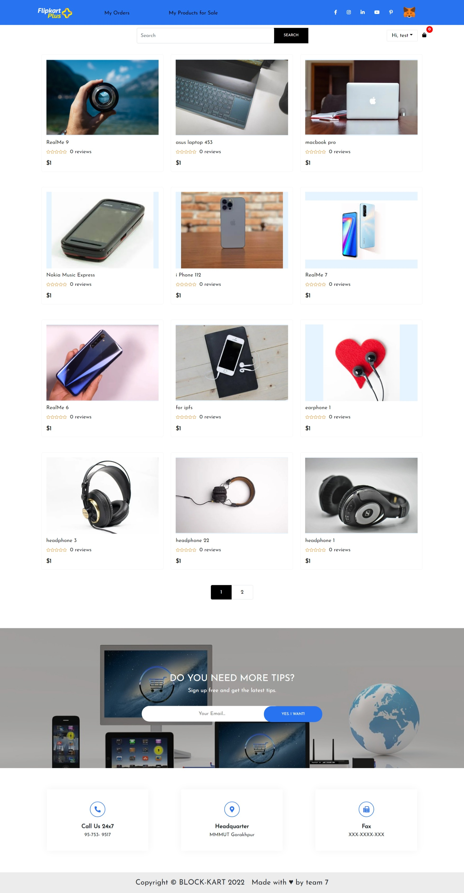 

#### Login and Registration of users
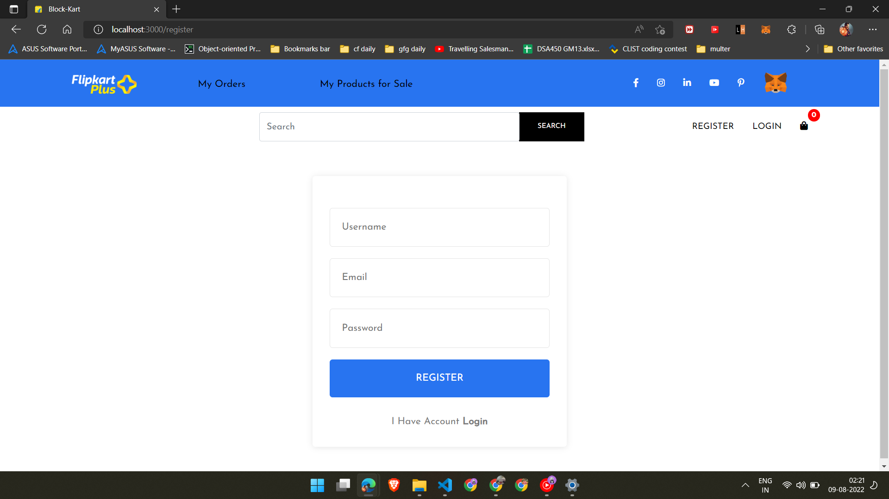 

#### Product page
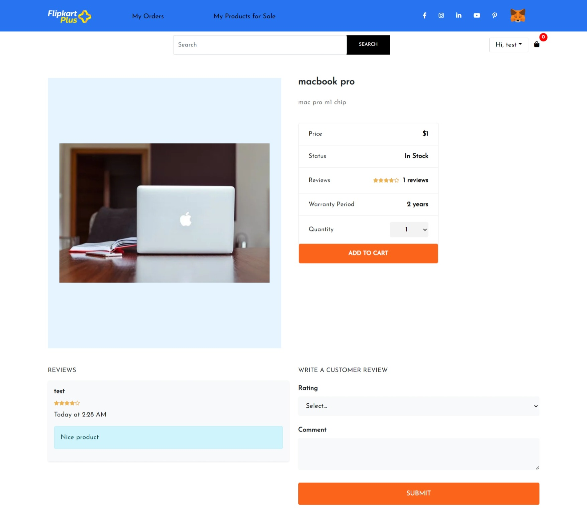 

#### Order Page
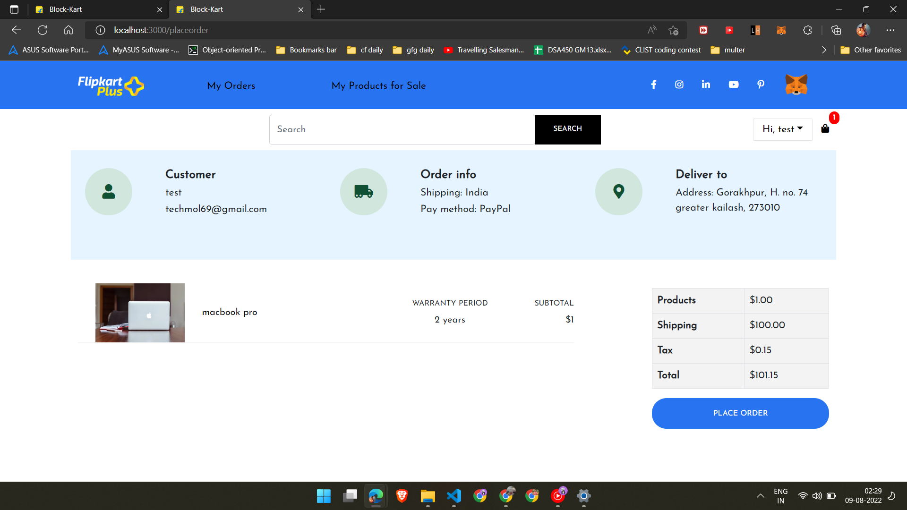 

##### Product Digital Warranty
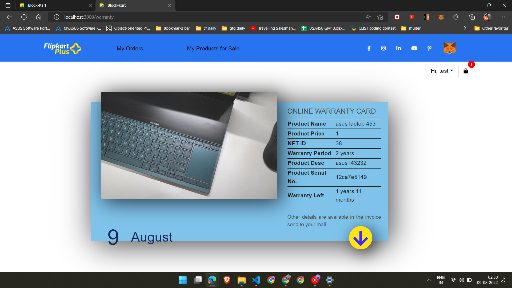 

#### User Profile
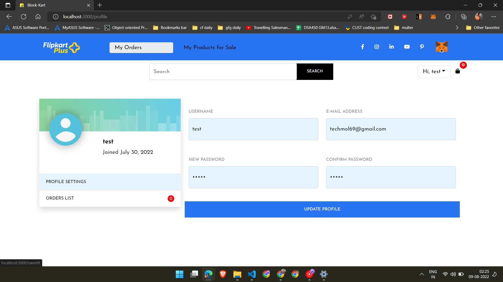 

### Admin Pannel

#### Dashboard
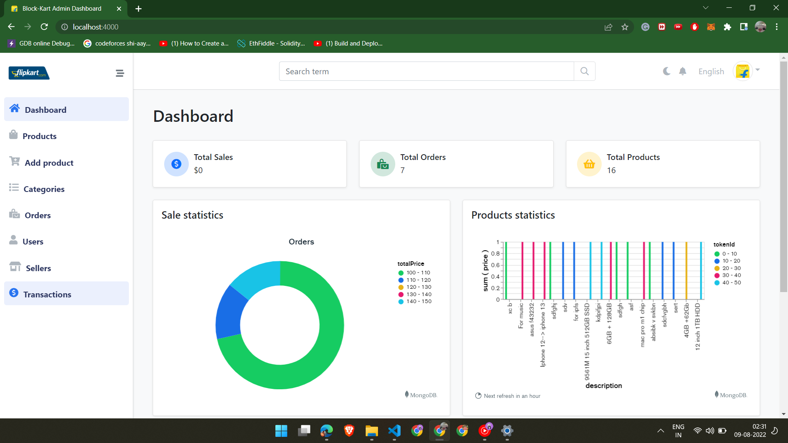 

#### Product list
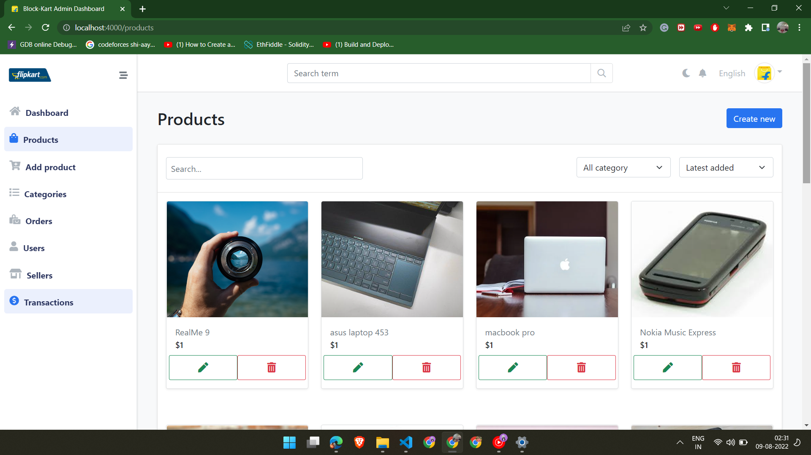 

#### Add New Products 
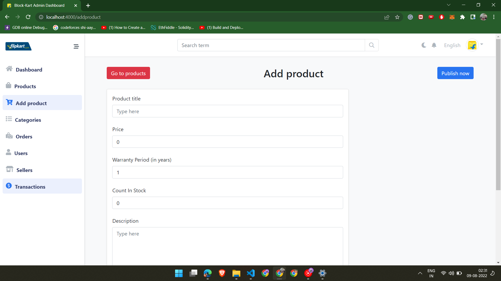 

#### User list
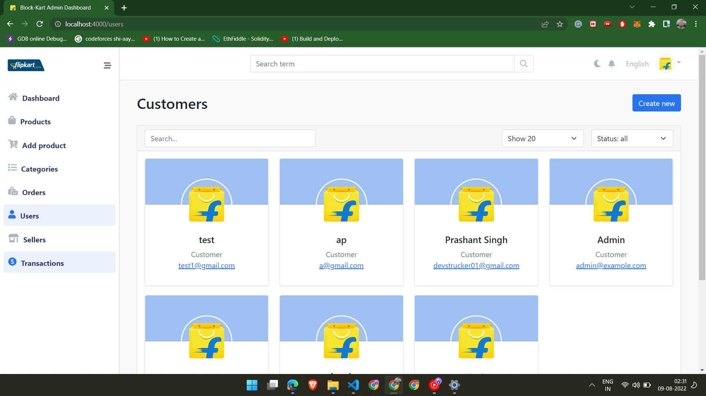 

#### Transaction details
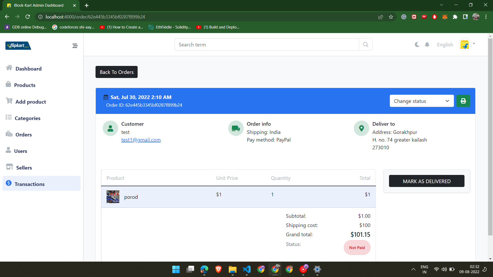 

## Intructions (to run this project on your local machine)
- Run npm i to install all the dependencies in client, server and dashboard folder
- Run npm start in the above three folder to start the application
- Open admin pannel and client localhost in different browsers.(having metamask extension installed)
- Add the following in the .env file in SERVER folder
  * PORT =5000
   * NODE_ENV=production
   * JWT_SECRET=secretkey
   * MONGO_URL=
